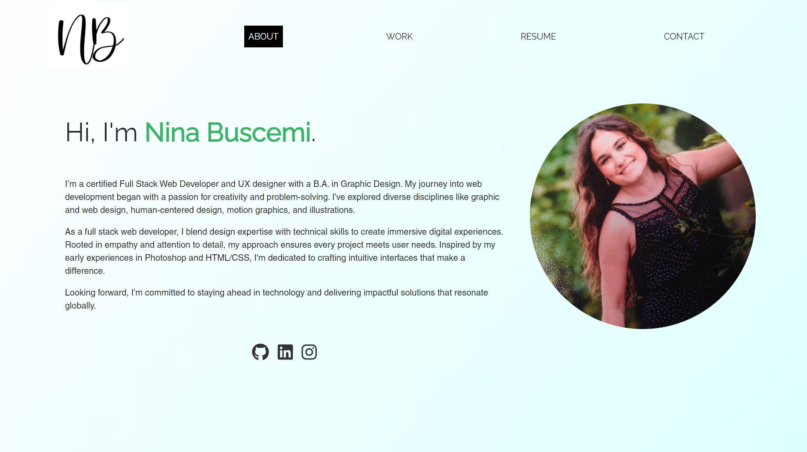

# React Portfolio


## Description

This portfolio website showcases my latest work as a developer and demonstrates my newly acquired React skills. It's a single-page application that provides a smooth user experience. When visitors land on the site, they'll see an 'About Me' page and a navigation bar. The nav bar allows users to easily access different sections, including a gallery of my recent projects, my resume, and a contact form. Users can also find links to my work on various platforms (GitHub, Linkedin, and Instagram).


## Table of Contents

- [Mockup](#mockup)
- [Deployed Application](#link)
- [Installation](#installation)
- [License](#license)
- [Questions](#questions)

## Mockup




## Deployed Application

Click [here](https://main--ninasportfolio.netlify.app/) to view the live site


## Installation

1. [Download](https://github.com/ninabuscemi/mod-20-react-portfolio) or clone the repository:

    ```
    git clone git@github.com:ninabuscemi/mod-20-react-portfolio.git
    ```

2. Run from the command line:

    ```
    install node.js
    ```
4. Run to install dependencies:

    ```
    npm install
    ```

5. Run to start the server:

    ```
    npm start
    ```

## License

The project is under MIT License.
 
## Questions

If you have any questions regarding the project, please, feel free to contact me:

- GitHub: [Nina Buscemi](https://github.com/ninabuscemi)